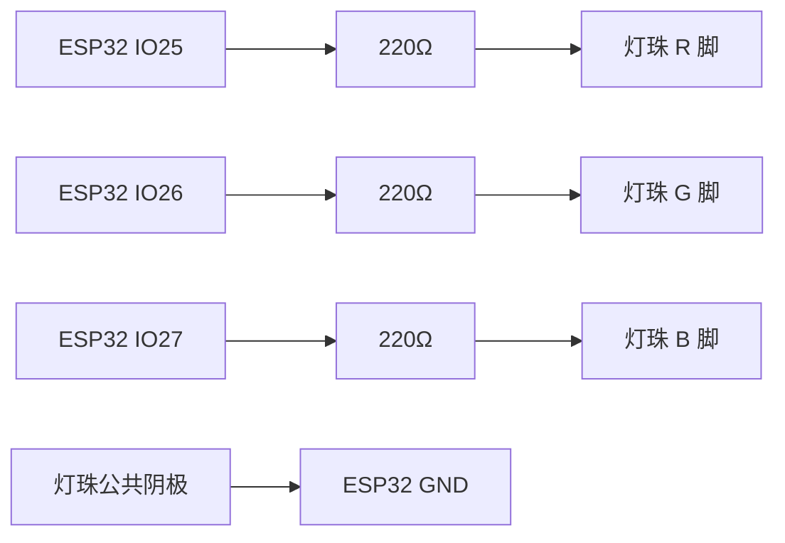

# KE3069：从接线到第一次演示

本项目已选定 **IO25 控制红色、IO26 控制绿色、IO27 控制蓝色**。四脚共阴 RGB 灯的公共脚接 GND，每种颜色串一个 220Ω 电阻。这里的 IO25 就是 GPIO25，是板上标识，不是“从左数第 25 根针”。

## 1. 拿出这些东西

ESP32 开发板、一颗四脚 RGB 灯、三根 220Ω 电阻、面包板、若干连接线，以及 Micro USB **数据线**。电池盒和面包板电源模块不接入本电路。

普通四环 220Ω 电阻常见色环为红、红、棕、金；以套件包装标注或测量为准，五环电阻读法不同。电阻没有正反方向，灯有脚位区别。

官方主板介绍写 WROOM-32E，商家此前称 WROOM-32D；两者都是 classic ESP32。本方案依据 KE3069 板图上的 IO25/26/27 丝印，不是按模块外形猜位置。到货若与图不同，先核对实物；不要将这个引脚方案用于 ESP32-C3/S3 等其他系列。

## 2. 断开 USB 后接线

| 开发板 | 中间经过 | RGB 灯的脚 |
| --- | --- | --- |
| IO25 | 220Ω 电阻一根 | R：红色阳极 |
| IO26 | 220Ω 电阻一根 | G：绿色阳极 |
| IO27 | 220Ω 电阻一根 | B：蓝色阳极 |
| GND | 连接线直接连接 | 公共阴极，官方图中的最长脚 |



这张图是电气连接图，不表示面包板的物理孔位。只把表中属于同一连接点的脚连接起来，不把三路短接。

### 怎么放在面包板上

标准面包板中间两侧通常各有五孔一组，**同一组的五孔内部导通**；中间沟槽把左右两组分开。两边标 +/− 的电源长条结构不同，有些中途断开。本方案可以不用电源长条，GND 直接接到阴极所在的孔组。

1. RGB 四根脚分别插在四个独立的孔组，不能插进同一组五个相通孔中。
2. R 所在孔组插入一根电阻的一端；电阻另一端放到空孔组，那个空孔组再接来自 IO25 的线。
3. G、B 以同样方式分别连接 IO26、IO27 和各自电阻。
4. 公共阴极所在孔组插入 GND 连接线。
5. 开发板可放在面包板旁，通过合适的母头/公头连接线接入，不必强行插进面包板遮住孔位。

按官方 RGB 示意图的朝向，脚序是 R、公共阴极、G、B。**转动灯珠会改变你看到的左右顺序**；对照[官方灯珠图](https://www.keyesrobot.cn/projects/KE3069/zh-cn/latest/_images/ae51546482ff149a5cd40ead3d110bc8.png)识别，不把文字脚序当作任意视角的左右顺序。公共阴极接 GND；三路颜色脚不接 5V，也不省略电阻。

## 3. 填写固件本地配置

在代码所在电脑复制 `firmware/include/config.example.h` 为 `firmware/include/config.local.h`，然后编辑本地文件：

```cpp
#define BEACON_WIFI_SSID "你的手机热点名称"
#define BEACON_WIFI_PASSWORD "你的手机热点密码"
#define BEACON_LED_ENABLED true
#define BEACON_COMMON_ANODE false
#define BEACON_RED_PIN 25
#define BEACON_GREEN_PIN 26
#define BEACON_BLUE_PIN 27
#define BEACON_MAX_DUTY 32
```

确认断电接线后才将 LED_ENABLED 改为 true。其余值按上面保留。密码只保存在本地，不提交 Git；包含密码的固件镜像也不分享。手机热点需启用 2.4GHz 或兼容 2.4GHz 的模式；5GHz-only 热点不适用于这块 classic ESP32。

## 4. 在连接开发板的电脑上编译和刷机

USB 数据线连接哪台电脑，就在哪台电脑刷机。SSH 连上手机不会把另一台电脑的 USB 设备自动映射到开发服务器。以下提供 Windows 和本开发机两种方式；选实际插着板子的电脑。

### Windows / PowerShell

需要本机可用的 Python 3 和项目文件。在项目根目录使用独立工具环境，不全局安装：

```powershell
py -m venv .local/firmware-tools
.local/firmware-tools/Scripts/python.exe -m pip install platformio==6.1.18
$env:PLATFORMIO_CORE_DIR = "$PWD/.local/platformio"
.local/firmware-tools/Scripts/python.exe -m platformio run -d firmware
.local/firmware-tools/Scripts/python.exe -m platformio device list
```

若 `py` 不存在，需先安装 Python，或使用已有 Python 3 的完整路径。运行目录里须包含整个 firmware 目录及其 platformio.ini，不能只复制 main.cpp。

插拔开发板，比较 device list 的串口列表以识别属于板子的 COM 口。官方板载 USB 串口芯片标为 CP2102-GMR；若插上没有串口，先换确认可传数据的线，再按官方主板教程处理驱动。

核对模块为 classic ESP32 且 flash 至少 4MB 后，使用识别出的实际串口，例如 **确认是 COM5 时**：

```powershell
.local/firmware-tools/Scripts/python.exe -m platformio run -d firmware --target upload --upload-port COM5
.local/firmware-tools/Scripts/python.exe -m platformio device monitor --port COM5 --baud 115200
```

COM5 只是例子，不要照抄到其他端口。上传会替换板上原有程序。串口监视器使用 Ctrl+C 退出，再做下一次上传，避免占用串口。

### 当前 Linux 开发机

本机已有项目内工具链；仅当板子实际接到这台主机时运行：

```bash
export PLATFORMIO_CORE_DIR="$PWD/.local/platformio"
.local/firmware-tools/bin/pio run -d firmware
.local/firmware-tools/bin/pio device list
```

假设确认开发板是 `/dev/ttyUSB0`，则：

```bash
.local/firmware-tools/bin/pio run -d firmware --target upload --upload-port /dev/ttyUSB0
.local/firmware-tools/bin/pio device monitor --port /dev/ttyUSB0 --baud 115200
```

端口无权限时先记录报错，不通过全局 chmod 放开串口权限。以上 Windows 流程尚未实机验证；本轮只实测本机 Linux 编译，没有执行任何 upload。

## 5. 看串口，确认开机

预期日志：

```text
AgentBeacon RGB: GPIO output enabled
Wi-Fi connected; device IP=手机分配的地址
```

刚启动没有收到状态时应黄色慢闪。若显示 GPIO output disabled，检查是否真正复制了 config.local.h 并启用输出，然后重新编译上传。

黄色可能偏红或偏绿，先确认两路均能点亮再调颜色，不能只凭肉眼黄色情况断定网络状态。首次插电若无正常日志，先提供串口输出；不要反复带电交换灯脚。

## 6. 手机指向真实设备

设备连接手机热点后，从串口记下实际 IP。手机 Termux 用以下命令确认能访问设备（把 ESP32实际IP 替换掉）：

```bash
curl --noproxy '*' --max-time 3 http://ESP32实际IP/health
```

预期 JSON 中 device 为 agentbeacon-rgb、led_enabled 为 true。此时不需要预先在 WLED 保存 preset。

手机当前运行的 Receiver 如果在前台，先 Ctrl+C。进入：

```bash
cd ~/agentbeacon/releases/receiver-et6Qrz
cp receiver/config.json "receiver/config.backup.$(date +%Y%m%d-%H%M%S).json"
```

编辑 receiver/config.json，把 `wledBaseUrl` 改为 `http://ESP32实际IP`，`dryRun` 改为 false；保留手机 host=100.91.207.103（若 Tailscale 地址没有变化）、presets 1～5 和 demoEnabled=false。再运行 `npm start`。字段名 wledBaseUrl 沿用现有接口，不表示设备运行 WLED。

## 7. 开始演示与排查

服务器项目目录运行 `npm run demo`，不要同时运行真实 Sender。按 1～5，分别观察熄灭、蓝色呼吸、红色闪烁、绿色常亮、黄色慢闪。

TUI 只在按键时发送。停留超过约 15 秒变黄是手机通信超时，不是 RGB 固件的 done 自动熄灭。需要长时间保持某态，使用指南中的显式 HTTP Demo；需要持续真实状态，退出 TUI 后运行 npm run sender。

| 现象 | 先检查 |
| --- | --- |
| 有串口但一直没有 Wi-Fi connected | 2.4GHz 热点、SSID/密码；不要提供密码给他人 |
| 手机访问 ESP32 超时 | 串口里的最新 IP、ESP32 是否仍在热点内；手机热点客户端访问路径待实测 |
| 显示状态正确但灯完全不亮 | led_enabled、公共阴极是否接 GND、面包板孔组是否连错 |
| 红绿蓝颜色对调 | 断电后按 R/G/B 表核对灯脚与线路 |
| 某一种颜色不亮 | 断电检查该路电阻和孔组，不能移除电阻尝试 |
| 固件刷机后还显示 unknown | 切换 Demo 状态或重启 Receiver，确保发出新请求 |

这份指南定义接法与步骤，尚未宣称实物通过。成功后记录板子型号、设备 IP、五态结果、断线恢复和现象；再进入真实 Agent 全链路验收。

依据：[Keyes 主板介绍](https://www.keyesrobot.cn/projects/KE3069/zh-cn/latest/docs/%E4%B8%BB%E6%9D%BF%E4%BB%8B%E7%BB%8D/2.%E4%B8%BB%E6%9D%BF%E4%BB%8B%E7%BB%8D.html)、[RGB 教程](https://www.keyesrobot.cn/projects/KE3069/zh-cn/latest/docs/5.Arduino%20C%20%E6%95%99%E7%A8%8B%20Windows%20%E7%B3%BB%E7%BB%9F.html#rgb-led)、[PlatformIO 上传参数](https://docs.platformio.org/en/latest/core/userguide/cmd_run.html)、[串口监视器](https://docs.platformio.org/en/latest/core/userguide/device/cmd_monitor.html)。
